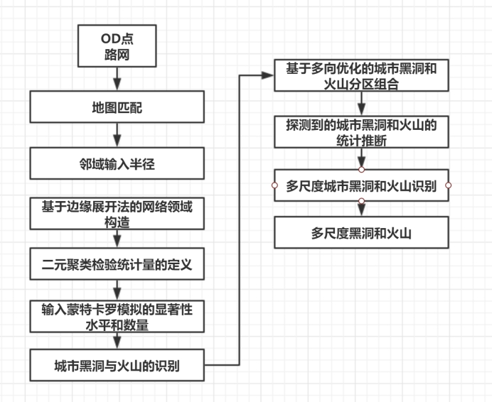
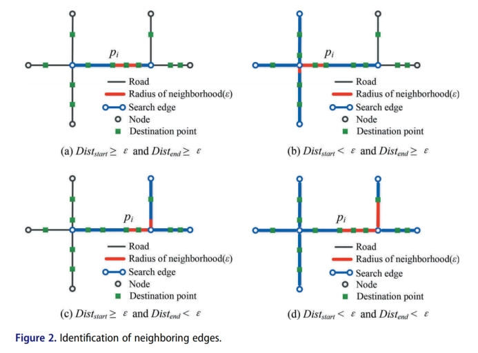
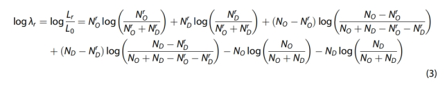
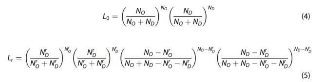
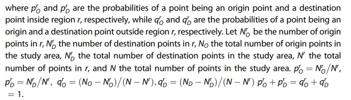
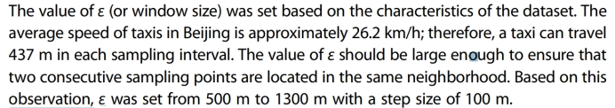
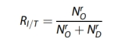
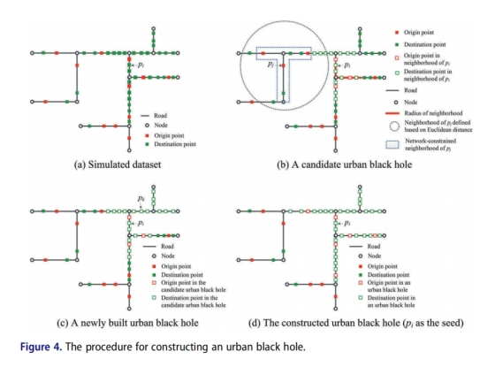
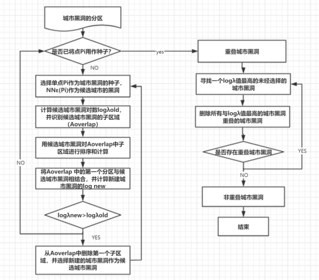
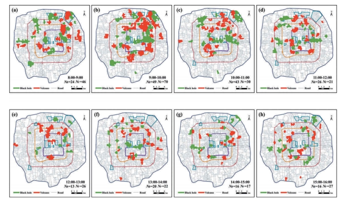

## 城市黑洞和火山的网络约束双变量聚类方法

> 论文：[Liu Q, Wu Z, Deng M, et al. Network-constrained bivariate clustering method for detecting urban black holes and volcanoes[J]. International Journal of Geographical Information Science, 2020, 34(10): 1903-1929.](https://www.tandfonline.com/doi/abs/10.1080/13658816.2020.1720027)


### 实验步骤

**探测城市黑洞和火山的网络约束双变量聚类方法**：城市火山是一个双变量的空间群，其起点形成热点，终点形成冷点，一个区域的流入和流出通过轨迹中记录的起点和终点（OD）点来计算。

**实验数据**：武昌单线路网数据，出租车轨迹点数据

**数据处理**：道路网划分为若干条小边（每条边都是一条直线）并表示为加权图G=（N，E），其中N是节点集，E是边集。每个起点或终点。

**流程**：

 

 

**1. 构造网络（2.1）**

为每个点构造网络约束邻域，网络约束邻域：

① 给定一个点pi和邻域ε的半径，边展开法找到pi所在的边e，然后计算pi到e的起始节点的距离和pi到e的结束节点的距离。

② 做判断（如图）

PS：文中ε的值是根据数据集的特征设置：北京市出租车平均时速约为26.2km/h；因此，出租车在每个采样间隔内可以行驶437米。ε的值应足够大，以确保两个连续采样点位于同一邻域。根据这一观察，ε从500 m设置到1300 m，步长为100 m。

 


**2. 构造用于检测城市黑洞和火山的检验统计量（2.2）**

基于Bernoulli的对数似然比检验统计量用于探测城市黑洞和火山

 

 

logλr值较高的区域r可能是城市黑洞或火山。

 

重复次数和显著性水平通常分别设置为99和0.05

 

城市黑洞和火山通过流入量与总流量的比值（RI/T）：

 


**3. 确定城市黑洞和火山的分区（2.3.1）**

给定一个很小的ε值，对于每个OD点pi，公式（3）可用于测试pi的网络约束邻域（NNε（pi））是否是城市黑洞或火山的子区域。采用montecarlo模拟方法估计NNε（pi）的p值，判断区域为城市黑洞或火山（详细于2.3.1）


**4. 基于多向优化的城市黑洞和火山分区组合（2.3.2-2.3.4）**

 

 


**5. 分析与可视化(参数选择与试验部分于第三章)**

输出城市黑洞和火山区域、火山（或黑洞）的RI/T值、地图中黑洞个数、地图中火山个数、区域内OD点个数




### 脚本使用说明

- `preprocess.py`

这个脚本一般不需要重新跑，主要功能是3部分：

1. 从shapefile（以`/data/wuchangroad_1`为前缀的多个文件） 读取路网信息并存储到`output/wuchangroad_network.csv`
2. 从`data/WUCHANG0.csv`读取和校验od数据并存储到`output/wuchangroad_od_cleaned.csv`
3. 将路网及od点的数据按24小时每1小时为间隔进行划分，每个小时的数据以RoadNetWork类的结构存储，最终以npy文件的方式保存到`output/network_split_time`目录下

```python
if __name__ == '__main__':
    # load and save network data from shape file
    save_net_info_form_shapefile('data/wuchangroad_1', 'output/wuchangroad_network.csv')
    # clean and verify od data
    clean_od_data('data/WUCHANG0.csv', 'output/wuchangroad_od_cleaned.csv')
    # save all network data (in form of npy file) defined in graph.roadnet.RoadNetwork
    save_network_from_time('output/network_split_time', 'output/wuchangroad_network.csv',
                           'output/wuchangroad_od_cleaned.csv')
    # calculate
    calc_average_road_length()
    # calc_average_velocity()
    pass
```

 

- `identify_subareas.py`

主要功能是：基于伯努利的对数似然比检验统计量和蒙特卡罗模拟，采用边缘拓展法，来识别一个邻域是否是黑洞或者火山。读入的是`output/network_split_time/`目录下的network数据，并将生成的结果保存到`output/subareas_split_time/`目录（存储 {pi => (lambda, neighborhood of pi)} 形式的字典，同样是npy文件，如`0_hole_`前缀的文件表示0点-1点时间段的黑洞数据）。

**注意：**如果要重新跑数据，将`output/subareas_split_time`下所有的文件删除

可以调整的参数有：

1. worker：进程数（不要大于cpu核数）
2. r_time: 模拟次数R
3. alpha: 显著性水平α
4. epsilon: 邻域的截断半径ε

```python
if __name__ == '__main__':
    """
    Identification of subareas of urban black holes and volcanoes
    based on a 1 hour division (total 24hours)
    """
    worker = 8  # Number of processes (recommended not to be larger than the number of cpu cores)
    r_time = 99  # the number of repetitions of Monte Carlo simulation
    alpha = 0.05  # significance level
    epsilon = 1200  # the neighbourhood cutoff radius
    split = split_worker(24, worker)
    with mp.Pool() as pool:
        pool.starmap(combine_subareas, split)
```

 

- `combine_subareas.py`

基于多向优化的城市黑洞与火山分区的组合，读取`output/subareas_split_time`目录下的数据，最终生成的结果保存到`output/hole_volcano/`下，将每个时间段的黑洞和火山图像保存到`output/results`目录下并在控制台输出**five-grade marking**的结果。

**注意：**由于默认读取的是保存的中间结果，所以如果要重新跑数据，将`_result = multi_scale_hole_volcano(_id)`这行取消注释，将`_result = load_identified_result(_id)`这行注释。反之亦然。

```python
if __name__ == '__main__':
    """
    Combination of subareas of urban black holes and volcanoes based on multi directional optimization
    based on a 1 hour division (total 24hours)
    """
    plt.figure(figsize=(5, 5))
    _hole_score, _volcano_score = {}, {}
    for _i in range(5):
        _hole_score[_i] = _volcano_score[_i] = 0
    for _id in range(24):
        # _result = multi_scale_hole_volcano(_id)
        # NOTE: The local cache is read by default, if you need to re-run the program,
        # comment out next line(228) and switch to the previous line(225)
        _result = load_identified_result(_id)
        plot_determine_hole_volcano(_id, *_result)
        save_identified_result(_id, *_result)
        analyse_result(*_result, _hole_score, _volcano_score)
    print('====== five-grade marking ======')
    print('hole:')
    for _lv, _hs in _hole_score.items():
        print(f'\t{grade_label[_lv]} = {_hs}')
    print('volcano:')
    for _lv, _vs in _volcano_score.items():
        print(f'\t{grade_label[_lv]} = {_vs}')
    print('===============================')
```